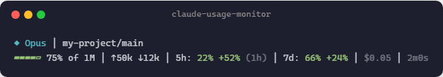
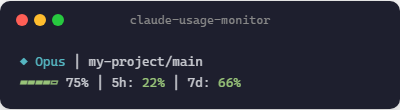
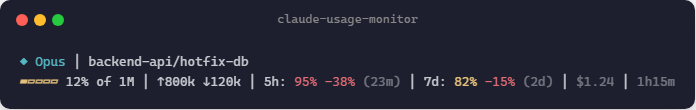

# claude-usage-monitor

A real-time statusline plugin for [Claude Code](https://docs.anthropic.com/en/docs/claude-code) that shows your 5-hour and 7-day quota remaining percentages, context window usage, token counts, and reset countdowns — right in your terminal.

Never get surprised by rate limits again.

No extra API key setup. No Python packages to install. It uses your existing Claude Code OAuth session.

---

## Showcase

### Healthy — plenty of quota remaining


### Moderate — usage climbing


### Critical — nearly exhausted


### Heavy Context — deep in conversation


### Fresh Session — no data yet


---

## What you get

```
◆ Opus │ my-project/main
▰▰▰▰▱ 75% │ ↑50k ↓12k │ 5h: 80% (1h) │ 7d: 34% │ 2m0s
```

| Segment | Description |
|---|---|
| `◆ Opus` | Active model |
| `my-project/main` | Project name + git branch |
| `▰▰▰▰▱ 75%` | Context window remaining (5-block gauge) |
| `↑50k ↓12k` | Input/output tokens this session |
| `5h: 80%` | 5-hour quota remaining % |
| `(1h)` | Time until 5h window resets |
| `7d: 34%` | 7-day quota remaining % |
| `2m0s` | Session duration |

### Color coding

| Color | Meaning |
|---|---|
| **Green** | > 30% remaining — you're good |
| **Yellow** | 10–30% remaining — slow down |
| **Red** | < 10% remaining — close to rate limit |

---

## Installation

### Prerequisites

- [Claude Code CLI](https://docs.anthropic.com/en/docs/claude-code) with an active subscription
- Python 3.10+ available as `python3`, `python`, or `py -3` (Windows)
- Windows: Git Bash (recommended)
- macOS / Linux: bash or zsh with `bash` available

### Setup

**1. Clone the repo**

```bash
git clone https://github.com/aiedwardyi/claude-usage-monitor.git
cd claude-usage-monitor
```

**2. Add to Claude Code settings**

Open `~/.claude/settings.json` and add the right `statusLine.command` for your OS.

**Windows (recommended)**

```json
{
  "statusLine": {
    "type": "command",
    "command": "C:\\path\\to\\claude-usage-monitor\\statusline.cmd",
    "padding": 0
  }
}
```

**macOS / Linux**

```json
{
  "statusLine": {
    "type": "command",
    "command": "bash /path/to/claude-usage-monitor/statusline.sh",
    "padding": 0
  }
}
```

Replace the example path with the actual path where you cloned the repo.

**Path examples**

- Windows: `C:\Users\your-name\path\to\claude-usage-monitor\statusline.cmd`
- macOS: `/Users/your-name/path/to/claude-usage-monitor/statusline.sh`
- Linux: `/home/your-name/path/to/claude-usage-monitor/statusline.sh`

**3. Optional sanity check**

Before restarting Claude Code, make sure the launcher runs:

**Windows**

```powershell
type nul | C:\path\to\claude-usage-monitor\statusline.cmd
```

**macOS / Linux**

```bash
printf '' | bash /path/to/claude-usage-monitor/statusline.sh
```

It should print:

```bash
Claude
```

**4. Restart Claude Code.** The statusline appears automatically.

---

## How it works

1. Claude Code pipes session JSON (model, context window, tokens, cost) to `statusline.sh` via stdin
2. `statusline.py` parses the session data and reads your OAuth token from `~/.claude/.credentials.json`
3. Calls the Anthropic usage API (`/api/oauth/usage`) to fetch your current 5h and 7d quota utilization
4. Caches the API response to your system temp directory for 5 minutes to avoid excessive calls
5. Outputs a two-line ANSI-colored statusline

### Caching

API responses are cached for **5 minutes** in your system temp directory (`tempfile.gettempdir()` in Python). A file-based lock prevents concurrent API calls. The cache is refreshed automatically in the background when stale.

### Authentication

The plugin reads your OAuth token from Claude Code's credential store at `~/.claude/.credentials.json` (key: `claudeAiOauth.accessToken`). You can also set `CLAUDE_CODE_OAUTH_TOKEN` as an environment variable to override.

---

## Compatibility

| Platform | Shell | Status |
|---|---|---|
| Windows 11 | Git Bash | Tested |
| macOS | bash / zsh | Supported by launcher, not deeply tested |
| Linux | bash / zsh | Supported by launcher, not deeply tested |

The launcher resolves `python3`, `python`, and Windows `py -3`, and the script forces UTF-8 output encoding to handle Unicode gauge characters on Windows.

---

## Customization

Every segment is toggleable via environment variables. Set them in your shell profile, or add them to the `env` block in `~/.claude/settings.json`:

```json
{
  "env": {
    "CQB_PACE": "1",
    "CQB_CONTEXT_SIZE": "1",
    "CQB_COST": "1"
  }
}
```

### Available options

| Variable | Default | Description |
|---|---|---|
| `CQB_TOKENS` | `1` (on) | Token counts (`↑50k ↓12k`) |
| `CQB_RESET` | `1` (on) | Reset countdown (`(1h)`, `(2d)`) |
| `CQB_DURATION` | `1` (on) | Session duration (`2m0s`) |
| `CQB_BRANCH` | `1` (on) | Git branch name |
| `CQB_CONTEXT_SIZE` | `0` (off) | Context window size label (`of 1M`) |
| `CQB_PACE` | `0` (off) | Pace indicator (`+52%` / `-38%`) |
| `CQB_COST` | `0` (off) | Session cost (`$0.05`) |

### Preset examples

**Maximal** — everything on:



```json
{ "env": { "CQB_PACE": "1", "CQB_CONTEXT_SIZE": "1", "CQB_COST": "1" } }
```

**Minimal** — just quota percentages:



```json
{ "env": { "CQB_TOKENS": "0", "CQB_RESET": "0", "CQB_DURATION": "0" } }
```

**Kitchen sink at critical** — when things get serious:



### What are the extra options?

- **Pace indicator** (`CQB_PACE`) — compares your actual usage rate against even pacing across the window. `+52%` means you're well under pace (green, good). `-38%` means you're burning faster than sustainable (red, bad). Suppressed when within +/-10%.
- **Context size** (`CQB_CONTEXT_SIZE`) — appends `of 1M` (or `of 200K`, etc.) next to the context remaining percentage.
- **Cost** (`CQB_COST`) — shows the session's total API cost in USD.

### Defaults

Out of the box with zero config, you get:

```
◆ Opus │ my-project/main
▰▰▰▰▱ 75% │ ↑50k ↓12k │ 5h: 80% (1h) │ 7d: 34% │ 2m0s
```

No configuration needed beyond the `statusLine` entry in settings.json. The plugin automatically:

- Detects your active model
- Reads the current git branch from your project directory
- Fetches quota data using your existing Claude Code credentials
- Color-codes everything based on usage severity

---

## Troubleshooting

**Statusline shows `5h: -- │ 7d: --`**
The API hasn't been called yet or the cache is stale. Wait a few seconds — the first call happens in the background and results appear on the next refresh.

**Unicode characters look broken**
Make sure your terminal supports UTF-8. On Windows, Git Bash works out of the box. If using cmd.exe or PowerShell, run `chcp 65001` first.

**No statusline appears at all**
Check that `statusLine.command` in `~/.claude/settings.json` points to the correct path.

- Windows: `statusline.cmd` also requires Git for Windows / Git Bash to be installed in a standard location.
- macOS / Linux: make sure `bash` plus `python3` or `python` are available on your PATH.
- Windows: if `python` is weird because of Microsoft Store aliases, the launcher will also try `py -3`.

---

## License

MIT

---

## Contributing

Issues and PRs welcome at [github.com/aiedwardyi/claude-usage-monitor](https://github.com/aiedwardyi/claude-usage-monitor).
